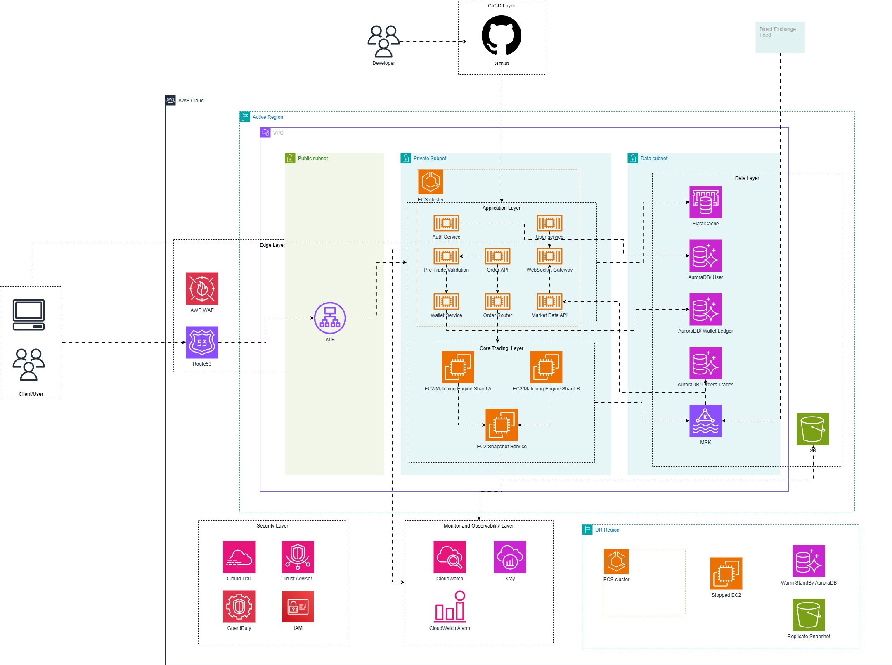

# Problem 2 - Building Castle In The Cloud

## Scope

This design covers a **spot trading platform** with five core features:

1. **User account and authentication**
2. **Wallet and balance ledger**
3. **Spot order placement and cancel**
4. **Matching engine**
5. **Live market data streaming**

The goal is to design for:

- **high availability**
- **p99 latency under 100ms**
- **500 requests per second**
- **clear growth path**
- **reasonable operational complexity**

The intentional to pick these five features because they are minimal features to start a trading platform, which is significantly important for startup business and also it is suitable for this challenge with time constraint and limited human resources. Thus, they are enough to show cloud architecture decisions around reliability, low latency, consistency, and scale.

---

## Assumption and Constraint

### Constraints

- **Cloud provider:** AWS
- **Throughput:** 500 requests/second
- **Response time target:** p99 < 100 ms

### Assumptions

- This is a **single-primary-region** trading platform with **multi-AZ deployment** for high availability.
- This is a **spot exchange**, not a derivatives platform.
- The matching engine is **partitioned by symbol**.
- **Correctness of wallet and order state** is more important than extreme global distribution.
- Similar to other trading platform, market data can tolerate slight eventual consistency, **but wallet and trade state cannot.**

### Design Principles

At 500 RPS, this is a real production system but for a startup/small to medium size business, it is **not yet large enough to justify Binance-scale complexity.** Even though it is a minimal system, the High Availability and Fault Tolerance need to be implemented as this is a financial trading system  where data loss and outage could cost extreme damage to revenue. So the design should prefer:

- managed AWS services where possible
- one primary region with multi-AZ resiliency
- warm disaster recovery instead of active-active cross-region matching
- simple and deterministic routing into the matching layer

Based on the requirements above, I have made decision to use **Aurora PostgreSQL** for transactional state, **ElastiCache** for fast cache and coordination, **MSK** for durable event streaming, and **ECS/Fargate** for most stateless services, while keeping the matching engine on more controlled compute. Aurora uses distributed shared storage for reliability, ECS/Fargate release operation overhead of server management for containers, ElastiCache is a managed in-memory store, and MSK is a managed Kafka service for streaming data. . For observability, I go with CloudWatch, CloudWatch Alarm as they are AWS-native and easy to integrate. Lastly, CI/CD is simply come with Github. Detail decision will be explained below

---

## Architecture Diagram



This architecture is intentionally split into seven concerns: **Edge**, **application services**, **core trading**, and **data/storage, observability, CI/CD, Security**. The most important separation is between the **critical transactional path** and the **market-data fan-out path**, so market data load does not directly interfere with order execution latency.

---

## Layer and services

### 1) Edge layer

#### Route 53

**Role:** public DNS and regional failover entry point.

**Why chosen:** it gives a simple way to direct traffic to the primary region and later switch to a DR region if needed.

**Alternative considered:** hard-coded endpoint or CloudFront-only routing.

**Why not the alternative:** hard-coded endpoints make failover harder operationally; CloudFront is useful but not necessary for this API-first trading system at the current scope.

---

#### AWS WAF

**Role:** protect internet-facing endpoints from common attack patterns and abusive traffic.

**Why chosen:** Trading APIs are public and sensitive. Edge filtering is a low-cost way to reduce risk before traffic reaches the application layer.

**Alternative considered:** relying only on application-level rate limiting.

**Why not the alternative:** app-only protection increases load on backend services and is a weaker defense boundary.

---

#### Application Load Balancer

**Role:** HTTP/HTTPS entry point that distributes traffic across service tasks in multiple Availability Zones.

**Why chosen:** ALB is a strong fit for service-based HTTP workloads and integrates naturally with ECS. ALB/ECS integration and multi-AZ deployment patterns are standard AWS architecture building blocks.

**Alternative considered:** API Gateway.

**Why ALB over API Gateway:** API Gateway is a valid choice, but for always-on internal microservice-style traffic at 500 RPS, ALB plus ECS is simpler to operate and usually more cost-effective.

---

### 2) Application layer

#### ECS on Fargate for stateless services

Services placed here:

- Auth Service
- User Account Service
- Order API Service
- Wallet Service
- Pre-Trade Validation Service
- Market Data API
- WebSocket Gateway
- Order Router

**Why chosen:** Fargate lets you run containers without managing EC2 instances or clusters, which makes it a strong choice for stateless APIs at this scale. It reduces operational burden and keeps the platform simple.

**Alternative considered:** EKS or EC2 Auto Scaling Groups.

**Why not the alternatives:** EKS gives more control, but it adds Kubernetes complexity that is not necessary at 500 RPS. EC2 gives more control too, but increases patching, capacity planning, and instance management overhead. Both option are not suitable for current requirements

---

---

### 3) Core trading layer

#### Matching Engine on EC2

**Role:** maintains in-memory order books, performs matching, and emits trade/order-book events.

**Why EC2 instead of Fargate:** The matching engine is the most latency-sensitive and stateful component. EC2 gives tighter control over compute behavior, memory, and failure handling than Fargate. Fargate is excellent for stateless APIs, but the matching engine benefits from more predictable instance-level control. Fargate as a serverless compute option that removes server management, which is exactly why I use it elsewhere but not here.

**Alternative considered:** run matching on ECS/Fargate or EKS.

**Why not the alternatives:** those can work, but for a stateful, low-latency core engine I prefer a simpler active/standby EC2 model.

**Design choice:** one **active leader per shard** plus one standby. This avoids split brain and preserves deterministic sequencing per symbol.

---

### 4) Data layer

#### Aurora PostgreSQL

Used for:

- user data
- wallet ledger
- order/trade persistence

**Why chosen:** Aurora PostgreSQL gives a relational model, ACID semantics, managed operations, replica support, and high availability. Aurora is PostgreSQL-compatible and notes that Aurora uses distributed shared storage designed for reliability, performance, and scalability. AWS also documents built-in replication and replica support within Aurora clusters.

**Alternative considered:** self-managed PostgreSQL on EC2, standard RDS PostgreSQL, or DynamoDB.

**Why not self-managed PostgreSQL:** too much operational overhead for backups, failover, patching, and replication.

**Why not standard RDS PostgreSQL:** it is valid, but Aurora gives a stronger HA and scaling story for the interview.

**Why not DynamoDB for the core ledger and orders:** the financial core is relational and transaction-heavy. Wallet reservations, settlements, trades, and history are easier to model and reason about in SQL.

---

#### ElastiCache for Redis

Used for:

- token/session cache
- idempotency keys or fast idempotency cache
- rate limiting
- hot market-data cache
- temporary WebSocket session metadata

**Why chosen:**  ElastiCache is a managed in-memory data store/cache that is easy to set up, manage, and scale. That makes it the right fit for low-latency cache and coordination workloads.

**Alternative considered:** self-managed Redis on EC2 or storing everything in Aurora.

**Why not the alternatives:** self-managed Redis adds ops burden, and pushing hot cache/rate-limit traffic into Aurora would be slower and more expensive.

---

#### Amazon MSK

**Role:** durable event stream for order accepted, order canceled, trade executed, and book-update events.

**Why chosen:** MSK i a fully managed Apache Kafka service. Kafka-style streams are a strong fit for durable ordered event flows and replay. That is important for decoupling the matching engine from downstream consumers and for recovery workflows.

**Alternative considered:** SQS, SNS, or EventBridge.

**Why not the alternatives:** those are good for generic async messaging, but Kafka/MSK is stronger when you want ordered partitions, replay, and stream-style consumers for market data and recovery.

---

#### Amazon S3

**Role:** order-book snapshots, backups, audit archives, and DR artifacts.

**Why chosen:** durable, low-cost object storage for recovery and archival use cases.

**Alternative considered:** EBS-only backups or storing snapshots in databases.

**Why not the alternatives:** S3 is simpler, cheaper, and better suited to durable snapshot retention than block storage or database tables.

---

### 5) Monitoring and Observability Layer

Services include: CloudWatch, CloudWatch Alarm, Amazon XRay

**Role:** Logging, Metrics monitoring and tracing for applications

**Why chosen:** easy to use and integration with AWS service, no operating overhead.

**Alternative considered:** Self-hosted LGTM stacks

**Why not the alternatives:** Less operation overhead, more suitable for medium system that currently in development and business startup.

---

### 6) CI/CD Layer

Services include: Github

**Role:** Continuous integration and continuous deployment.

**Why chosen:** Powerful tools, suitable for both SMB and Enterprise grade. Simple but efficience. 

---

### 7) Security Layer

Services includes:

- **AWS IAM**
- **Amazon GuardDuty**
- **AWS Trusted Advisor**
- **AWS CloudTrail**

**Why chosen:** This is the foundation layer of AWS security, good for medium system like this.

---

## Flow

### 1) Login flow

```
Client -> ALB -> Auth Service -> Aurora(User) / Redis -> token returned
```

This is kept simple and independent from trading so that authentication issues do not tightly couple with matching behavior.

---

### 2) Place order flow

```
1. Client sends place-order request
2. ALB routes to Order API
3. Order API validates payload and idempotency
4. Pre-Trade Validation checks symbol rules and user permissions
5. Wallet Service reserves funds in Aurora ledger
6. Order Router sends request to the correct matching-engine shard
7. Matching Engine accepts the order and attempts match
8. Matching Engine publishes events to MSK
9. Downstream consumers update order/trade records and market-data views
10. WebSocket Gateway pushes updates to clients
```

The key high-level design decision is that the **critical synchronous path ends at the matching-engine acknowledgement**. Persistence fan-out, market-data propagation, and other downstream work happen asynchronously via MSK so the order API can stay within the latency budget. AWS’s managed streaming and managed caching/database services support this split between synchronous core actions and asynchronous downstream processing.

---

### 3) Cancel order flow

```
1. Client sends cancel request
2. Order API validates request and ownership
3. Router sends cancel request to the matching-engine shard
4. Engine cancels the live order if still open
5. Wallet Service releases reserved funds
6. Events are emitted to MSK
7. Order history and live feeds are updated
```

---

### 4) Market data flow

```
Matching Engine -> MSK -> Market Data API / WebSocket Gateway -> Clients
```

This separation is important. Market-data clients can be numerous and bursty; they should not directly pressure the matching engine or ledger database.

---

## Plan for scaling when product grow

### Phase 1: Current target

This is the design for the current requirement:

- one AWS primary region
- multi-AZ deployment
- ECS/Fargate for stateless services
- two matching-engine shards on EC2
- Aurora PostgreSQL
- ElastiCache Redis
- MSK
- S3 backups and snapshots
- warm DR region

This setup is enough for 500 RPS while keeping p99 latency under 100 ms realistic, because the synchronous path is short and the infrastructure is mostly managed.

---

### Phase 2: Moderate growth

When traffic grows beyond the initial target, I would scale in this order:

#### Scale stateless services horizontally

Increase Fargate tasks for:

- Auth
- Order API
- Wallet API layer
- Market Data API
- WebSocket Gateway

This is the easiest and lowest-risk scaling step because these services are stateless.

#### Increase matching capacity by shard

Add more matching-engine shards and repartition symbols. High-volume symbols can move to dedicated shards.

#### Add Aurora read replicas

Use replicas for:

- order history
- user history
- back-office read queries

Aurora replicas is a standard method to scale reads and improve availability.

#### Expand Redis capacity

Increase ElastiCache size or shard layout if hot cache, rate-limit counters, or connection metadata grows.

#### Increase MSK partitions

As event volume rises, partition more aggressively by symbol group to preserve parallelism and ordered consumption.

---

### Phase 3: Larger product scale

If the product becomes much larger, I would evolve the design further:

- dedicate the hottest trading pairs to their own matching nodes
- separate Aurora clusters by domain if needed: users, ledger, orders
- isolate institutional/API-heavy traffic from retail traffic
- scale WebSocket infrastructure independently from REST APIs
- add more advanced shard rebalancing and operational tooling
- strengthen DR into faster regional promotion if business RTO/RPO requires it

At that point, I would revisit whether some supporting workloads should move to DynamoDB or whether some consumers should become specialized stream processors. But I would still keep the financial source of truth relational unless the business scale clearly justified a more complex redesign.

---

## Final summary

This design stays simple on purpose.

- **Aurora PostgreSQL** is the source of truth for relational, transaction-heavy financial state.
- **ECS/Fargate** runs the stateless services with low operational overhead.
- **EC2** is reserved for the matching engine because it is stateful and latency-sensitive.
- **ElastiCache Redis** handles cache and coordination workloads.
- **MSK** decouples the matching core from downstream persistence and live streaming.
- **S3** provides durable snapshots and backup storage.
- **One primary region with multi-AZ plus warm DR** gives a practical balance between availability, complexity, and cost.

That makes the platform credible for the stated requirements without overengineering it.
